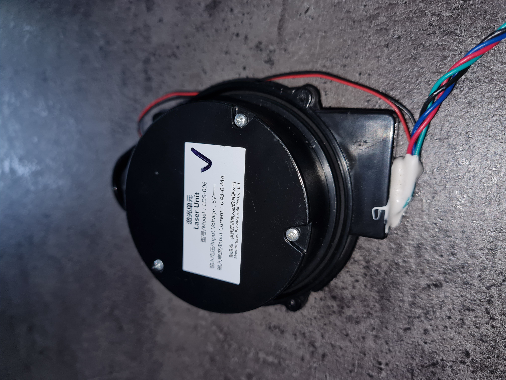
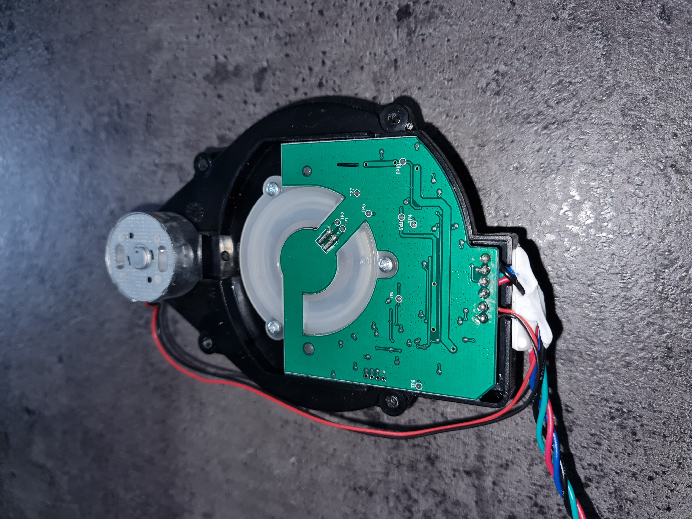

# LiDAR LDS-006

     

# Pinout
- Red = 5V
- Black = GND
- Green = UART RX (3,3V)
- Blue = UART TX (3,3V)

# Communication

baud:  115200

startbyte 0xFA gefolgt von 21 Bytes

| index | Beschreibung    |           |
| ----- | --------------- | --------- |
| 0     | Start           | 0xFA      |
| 1     | Winkel          | 0xA0-0xF9 |
| 2     | Drehzahl L-Byte |           |
| 3     | Drehzahl H-Byte |           |
| 4     | Distanz L (0)   |           |
| 5     | Distanz H (0)   |           |
| 6     | Reflexion L (0) |           |
| 7     | Reflexion H (0) |           |
| 8     | Distanz L (1)   |           |
| 9     | Distanz H (1)   |           |
| 10    | Reflexion L (1) |           |
| 11    | Reflexion H (1) |           |
| 12    | Distanz L (2)   |           |
| 13    | Distanz H (2)   |           |
| 14    | Reflexion L (2) |           |
| 15    | Reflexion H (2) |           |
| 16    | Distanz L (3)   |           |
| 17    | Distanz H (3)   |           |
| 18    | Reflexion L (3) |           |
| 19    | Reflexion H (3) |           |
| 20    | CRC L-Byte      |           |
| 21    | CRC H-Byte      |           |

Prüfsumme (CRC) ist die arithmetische Summe aller Bytes, Startbyte mit eingeschloßen.

Winkel = (Winkel_Raw - 0xA0) * 4. 

z.B.: Winkelwert = 0xA0, heiß Winkel beträgt 0°
- Distanz (0) = Wert für 0°
- Distanz (1) = Wert für 1°
- Distanz (2) = Wert für 2°
- Distanz (3) = Wert für 3°

Winkelwert = 0xA1, heiß Winkel beträgt 4°
- Distanz (0) = Wert für 4°
- Distanz (1) = Wert für 5°
- Distanz (2) = Wert für 6°
- Distanz (3) = Wert für 7°
  
## Commannds:
Damit der Sensor(Motor) startet, muss man ein Befehl schicken:
- startlds$

Zum Stoppen des Motors:
- stoplds$

# Software

Hier findest du LabView Code (2023 32bit CommunityEdition): [LabView Vi](LabView/LIDAR_LDS-006.vi). Buttons wurden aus der "DMC GUI Suite" benutzt. Unten im Info findest du auch ein Python-Code ;-)

# Info
https://www.jentsch.io/lds-006-lidar-sensor-reverse-engineering/

https://github.com/msoftware/LDS-006-Lidar-Sensor-Reverse-Engineering
